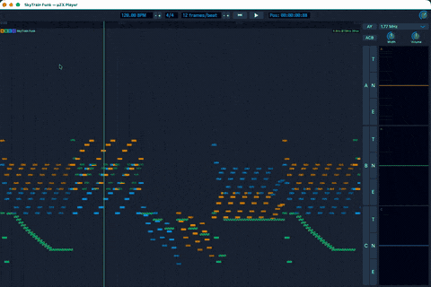

# µZX — Chiptune Music Tool

[](LICENCE.md)
[]()

A modern tool for composing and playing back chiptune music for platforms using the AY-3-8910/YM2149 sound chips — ZX Spectrum, Amstrad CPC, MSX, Atari ST, and others. While the name references ZX Spectrum, the architecture is chip-agnostic and designed to support additional sound chips in the future. Built with JUCE, targeting macOS, Windows, and Linux, with iOS and Android possible. Features a timeline-based DAW interface with precise chip emulation.

```text
        █▌█▌█▌  █▌█▌█▌  █▌  █▌  █▌█▌█▌  █▌
        █▌  █▌    █▌      █▌    █▌█▌    █▌
  █▌█▌█▌█▌█▌█▌  █▌█▌█▌  █▌  █▌  █▌█▌█▌  █▌█▌█▌█▌
        █▌
                        |   |
    ,---.---.  ,---.  --|---|--  ,---.   ,---
    |   |   |       |   |   |   |    |  |
        |   |   ,---|   |   |   |---'   |
            |  |    |   |   |   |       |
               `---'    |   |    `---'
                        `-- `--
         ,--------.   ,---.
         `---/ / / \ / / /
            / / / \ ' / /
    B8   88  / /   / / /    Copyright 2025-2026
    B8   88   /   / / . \     pixelmatter.org
    B8.  88. /---/ / / \ \
    B8"oo""8o --'---'   `-'
    BP
```



## Features

**Three applications from one codebase:**

- **µZX Studio** — full-featured PSG music editor with timeline, instruments, and effects. Includes µZX Tuning.
- **µZX Player** — lightweight playback for `.uzx` projects and `.psg` files
- **µZX Tuning** — standalone tuning table editor for exploring chip tuning systems. (Included in µZX Studio as a built-in tool)

## Vision

µZX is being developed as the music subsystem of **MoTool** — a planned demotool for retrocomputer demoscene production. MoTool does not exist as a release yet; it will launch as a separate project on the shared codebase once the timeline supports video material and emulator integration. See [docs/Vision.md](docs/Vision.md) for the full picture.

**Music composition:**

- Timeline-based arranging with tracks, clips, and automation
- **Multiple chips** — add chip plugins to multiple tracks or load multiple PSGs to separate tracks for multi-chip compositions.
- ChipInstrument plugin with ADSR envelopes for AY chip
- MIDI to PSG conversion with configurable tuning systems
- Real-time AY-3-8910/YM2149 emulation via [ayumi](https://github.com/true-grue/ayumi)

**Tuning systems:**

- 12-TET, 5-Limit Just Intonation, and custom tuning tables
- Visual tuning grid with note tooltips and scale highlighting
- Configurable chip clock frequency and A4 reference
- CSV export of tuning tables

**Visualization:**

- PSG clip display with notes, noise/envelope decoration, and note pitch scale
- Integrated oscilloscope displays per AY channel
- Standalone scope plugin

## Download

See [Releases](https://github.com/Pixel-Matter/uZX/releases) for pre-built binaries.

## Building from Source

```bash
git clone --recursive https://github.com/Pixel-Matter/uZX.git
cd uZX
cmake -S . -B build
cmake --build build
```

See [CONTRIBUTING.md](CONTRIBUTING.md) for detailed build instructions, prerequisites, and build targets.

## Documentation

- [Design](docs/Design.md) — architecture overview
- [Tuning Systems](docs/Tuning%20Systems.md) — tuning system design
- [µZX Player](docs/uzx-player.md) — Player variant architecture
- [Parameter Binding](docs/Parameter%20binding.md) — parameter binding system
- [OVM Design Pattern](docs/OVM%20Design%20pattern.md) — state management
- [Roadmap](docs/ROADMAP.md) — planned features and release milestones

## Community

Join the [µZX Discord](https://discord.com/channels/1103598609804562463/1357634772666552340) for support, discussion, and to connect with other users.

## Contributing

Contributions are welcome! See [CONTRIBUTING.md](CONTRIBUTING.md) for build setup, code style, testing, and how to submit changes.

## Credits

- [Tracktion Engine](https://github.com/Tracktion/tracktion_engine/) — audio engine foundation
- [JUCE](https://juce.com/) — cross-platform C++ framework
- [ayumi](https://github.com/true-grue/ayumi) by Peter Sovietov (true-grue) — AY-3-8910/YM2149 emulation

Greets to diver, spke, n1k-o, bfox, wbcbz7, Pator, Megus, Volutar and all ZX Spectrum musicians and demosceners!


## About

See [AUTHOR.md](AUTHOR.md) for the story behind this project.

## License

[GPL-3.0](LICENCE.md)
