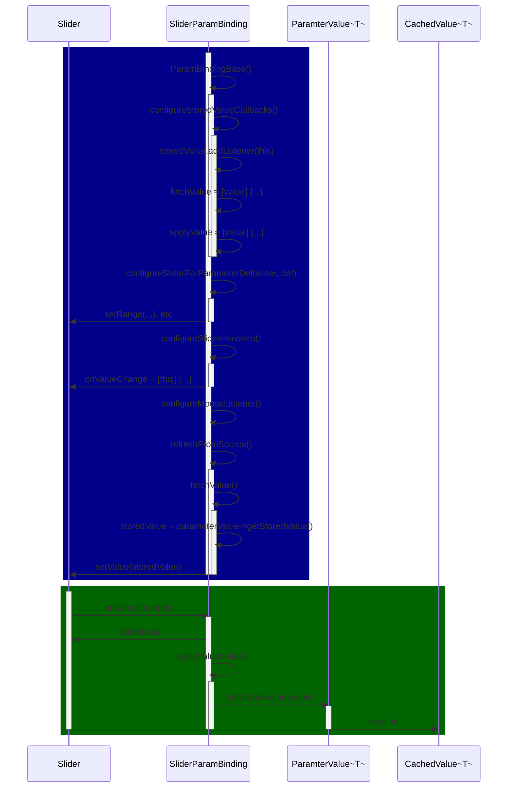

# Sequence diagram of updating paramater from Widget to ParameterValue

Deprecated

```mermaid
sequenceDiagram

participant Slider
participant SliderParamBinding
participant ParamterValue~T~
participant CachedValue~T~

rect darkblue
activate SliderParamBinding
    SliderParamBinding->>SliderParamBinding: ParamBindingBase()
    activate SliderParamBinding
        SliderParamBinding->>SliderParamBinding: configureStoredValueCallbacks()
        activate SliderParamBinding
            SliderParamBinding->>SliderParamBinding: storedValue.addListener(this);
            SliderParamBinding->>SliderParamBinding: fetchValue = [value] {...}
            SliderParamBinding->>SliderParamBinding: applyValue = [value] {...}
        deactivate SliderParamBinding
    deactivate SliderParamBinding

    SliderParamBinding->>SliderParamBinding:  configureSliderForParameterDef(slider, def);
    activate SliderParamBinding
        SliderParamBinding->>Slider: setRange(...), etc
    deactivate SliderParamBinding

    SliderParamBinding->>SliderParamBinding:  configureSliderHandlers();
    activate SliderParamBinding
        SliderParamBinding->>Slider: onValueChange = [this] {...}
    deactivate SliderParamBinding
    SliderParamBinding->>SliderParamBinding:  configureMouseListener();
    SliderParamBinding->>SliderParamBinding:  refreshFromSource();
    activate SliderParamBinding
        SliderParamBinding->>SliderParamBinding: fetchValue()
        activate SliderParamBinding
            SliderParamBinding->>SliderParamBinding: storedValue = parameterValue->getStoredValue();
            SliderParamBinding->>Slider: setValue(storedValue)
        deactivate SliderParamBinding
    deactivate SliderParamBinding
deactivate SliderParamBinding
end

rect darkgreen
activate Slider
    Slider->>SliderParamBinding: onValueChange()
    activate SliderParamBinding
        SliderParamBinding->>Slider: getValue()
        SliderParamBinding->>SliderParamBinding: applyValue(value)
        activate SliderParamBinding
            SliderParamBinding->>ParamterValue~T~: setStoredValue(value)
            activate ParamterValue~T~
                ParamterValue~T~->>CachedValue~T~: = value
            deactivate ParamterValue~T~
        deactivate SliderParamBinding

    deactivate SliderParamBinding
deactivate Slider
end
```
