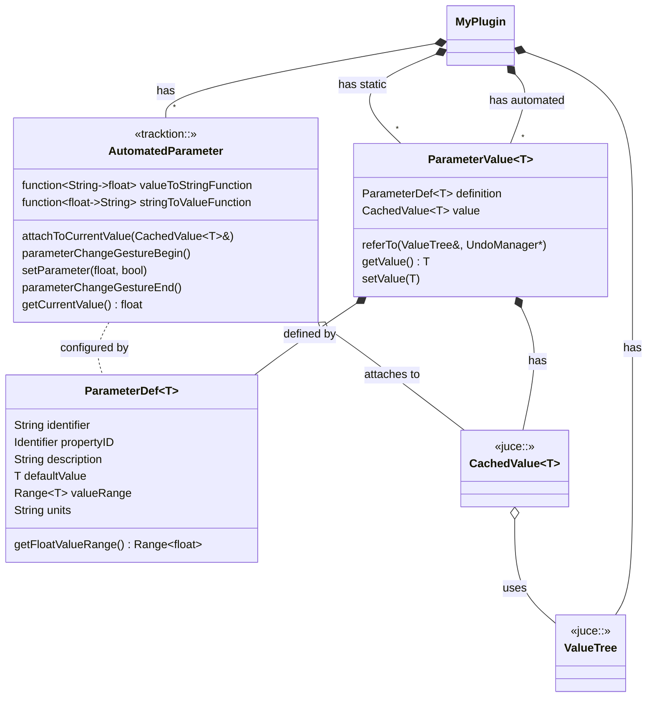
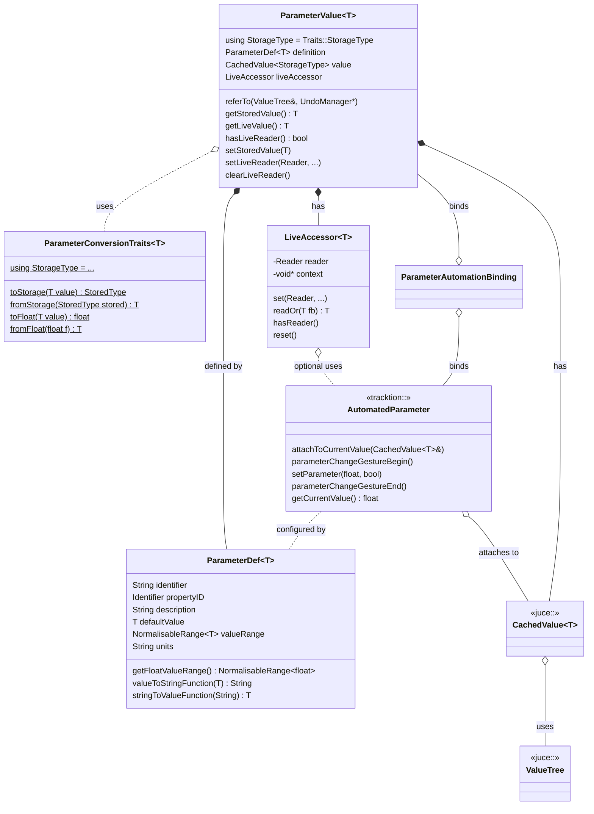
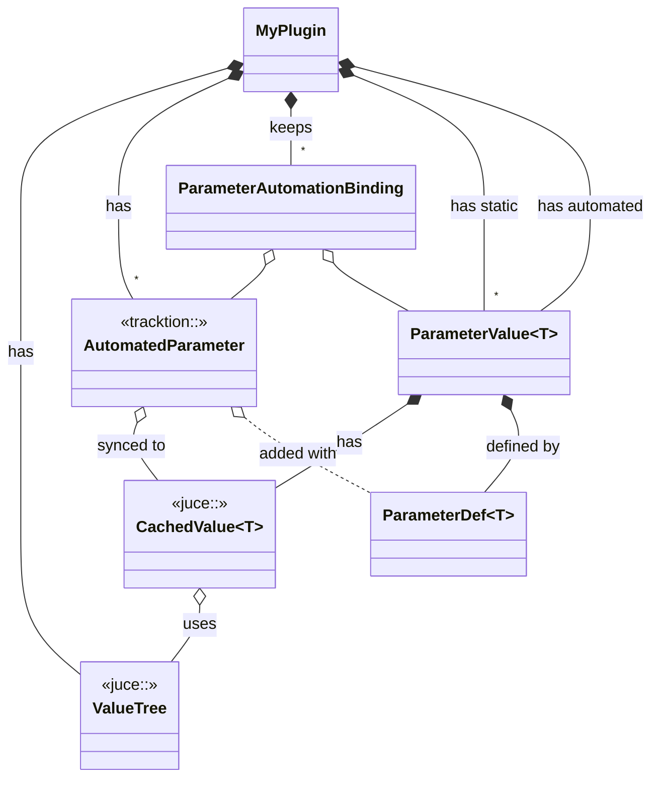
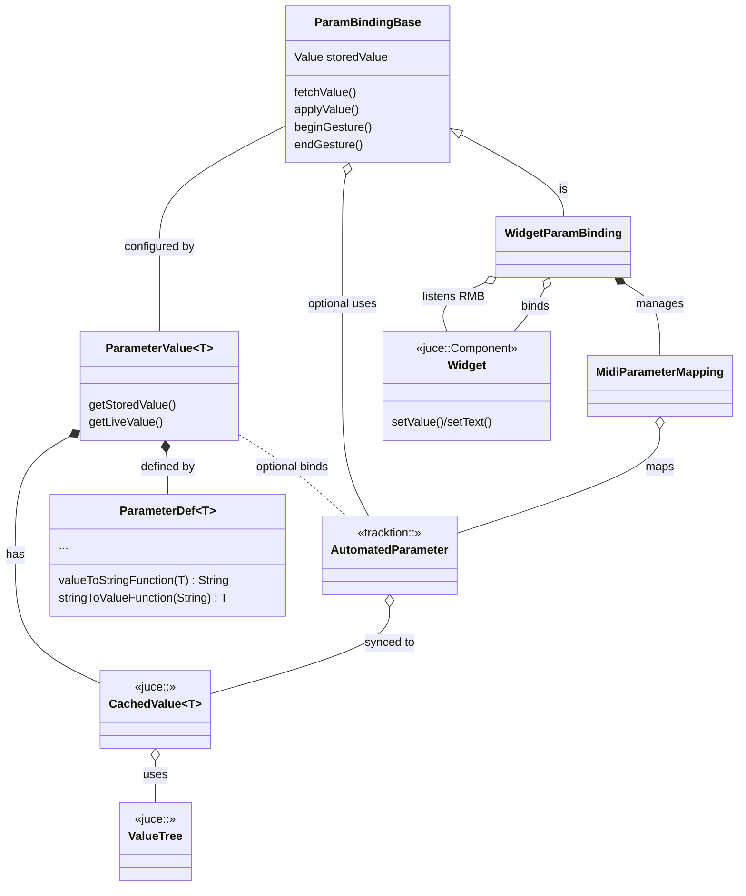

# Parameter Binding Architecture

The parameter subsystem bridges persistent edit state, automation metadata, and interactive controls. Typed parameter definitions live beside the ValueTree state, while UI bindings observe both automation callbacks and stored values.

Actually what I wanted is to prevent combinatorial explosion of classes and templates for types (int, float, bool, string, enum), bindings (`tracktion::AutomatableParameter` attached to `juce::CachedValue<T>` or `juce::CachedValue<T>` only) and widget classes (`Slider`, `Label`, `TextButton`, `Combobox`, ...). So I want to have simple system of classes that can bind any `ParameterValue<T>` to any widget and optionally to `tracktion::AutomatableParameter`.

## Type erasure

Because `tracktion::AutomatableParameter` is not a template, we need type erasure to bind `ParameterValue<T>` to `tracktion::AutomatableParameter`. Thus `ParameterValue<T>` values must be converted to/from float and also has float-string conversion functions utilized by `tracktion::AutomatableParameter`. The question is where to put these conversion functions: in `ParameterDef<T>` callbacks or in separate static traits class `ParameterTraits<T>`?

`CachedValue<T>` needed for storing parameter values in plugin's ValueTree state, juce conversion traits used to map T to/from ValueTree property types, for example human-readable strings for EnumChoice types. Also this ensures backwards compatibility when reading old ValueTree states.

`tracktion::Plugin` maintains a list of `tracktion:AutomatedParameter` instances, each of which is linked to a `CachedValue<T>` instance.

`ParameterDef<T>` is needed for defining parameter name, id, description, default value, range, units, conversion functions between T and float/string.

`ParameterValue<T>` needed for grouping `CachedValue<T>` with `ParameterDef<T>`. Plugins maintain sctructs of parameters, automated and static.

Widgets should be configured by `ParameterDef<T>` for displaying name, units, range, etc
Widgets bind to `ParameterValue<T>` instances, which may be static or automated `ParameterValue<T>` instances.
Static binding binds widget to `CachedValue<T>` only, converts widget values to/from T. We should introduce conversion scheme without need to define conversion functions/structs for every pair Widget<->T. In widget binding we can fix for every wighet type which types `T` (or subset) is works with. Widget binding should be a separate class from wigget class itself.

## Subclassing AutomatableParameter

We actually can subclass it to:

- Instantiate concrete types aware of type `T`, `AutomatableBindedParameters<T>`,
  no neeed to maintain separate bindings lists in plugins.
- Add constructor to accept `ParameterValue<T>` and configure parameter by it.
- Override `isDiscrete()`, `getNumberOfStates()`, etc for handling `EmumChoice` types
- Store binding to `ParameterValue<T>`

But alas we can not subclass `AutomatableParameter::AttachedValue` because it is not exposed in public API.
So we can not attach even subclassed parameter to `CachedValue<T>` where `T` is not float, int or bool, for example, enum serializable to `String` in `Var`;

## Conversion functions

`juce::Var` to type `T` conversion is handled by `juce::VariantConverter` specializations, for example `juce::VariantConverter<EnumChoice>`.

`tracktion::AutomatableParameter` uses float values, so we need conversion functions between T and float. These are provided by `ParameterConversionTraits<T>` specializations, for example `ParameterConversionTraits<EnumChoice>`.

TODO

## Domain overview



## Parameter-related core design overview

Adding bindings between `ParameterValue<T>` and `AutomatedParameter`.



## Plugin-centered design overview



## WidgetParamBinding-centered design overview



```text
leaving out for a while for clarity

    class MyPluginUI {
        <<juce::Component>>
    }

    MyPlugin *-- "*" AutomatedParameter : has

    MyPluginUI *-- "*" Widget : contains
    MyPluginUI *-- "*" WidgetParamBinding : contains

    Plugin <|-- MyPlugin : is

    DynamicParams *-- "*" ParameterValue~T~ : contains
    StaticParams *-- "*" ParameterValue : contains

    ParamBindingBase <|-- WidgetParamBinding : is

    WidgetParamBinding *-- MouseListenerWithCallback : has
    MouseListenerWithCallback o.. WidgetParamBinding : calls back
    MouseListenerWithCallback o-- Widget : listens to

    MyPlugin *-- ValueTree : has
    MyPlugin *--  "*" ParameterValue~T~: has static
    MyPlugin *--  "*" ParameterValue~T~   : has automated
    MyPluginUI o-- MyPlugin : edits


```
