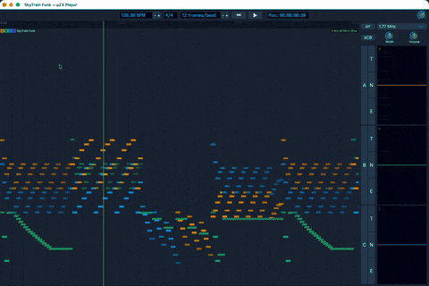

# µZX User Guide

µZX is a suite of applications for working with PSG chip music (AY-3-8910 / YM2149), targeting ZX Spectrum demoscene production.

---

## Applications

| App | Description |
|-----|-------------|
| **µZX Studio** | Full-featured PSG music editor with timeline, instruments, and automation (Work in progress) |
| **µZX Player** | Lightweight player with visualization for `.psg` and `.uzx` files |
| **µZX Tuning** | Tuning table (note table) editor/viewer. Supports equal temperament and just-intonation |

---

## µZX Player

A minimal player for listening to PSG chip music files.



### Opening Files

- **Drag and drop** a `.psg` or `.uzx` file onto the window.
- **File menu → Open** (`Cmd+O` / `Ctrl+O`).
- **Double-click** a `.psg` or `.uzx` file in Finder / Explorer (file association registered on install).
- Pass a file path as a command-line argument.

### Transport Bar

Located at the top of the window.

| Control | Description |
|---------|-------------|
| Rewind (⏮) | Jump to the beginning |
| Play/Pause (▶/⏸) | Start or pause playback |
| Position readout | Current time; format switches between bars/beats and mm:ss |
| BPM control | Tempo in BPM (inc/dec buttons or direct entry) |
| Master volume knob | Global output level |

**Keyboard shortcuts:**

| Key | Action |
|-----|--------|
| `Space` | Play / Pause |
| `Home` | Rewind to start |
| `Cmd+O` / `Ctrl+O` | Open file |
| `Cmd+Q` / `Ctrl+Q` | Quit |
| `Shift+Wheel` | Horizontal scroll |

### Timeline

The timeline shows the loaded file as a clip on a track. Click anywhere on the ruler or timeline to seek to that position.

Scroll horizontally with `Shift+Wheel` or the scrollbar.

### AY Side Panel

A panel on the right side of the window shows the AY chip plugin controls for the currently selected track. Here you can adjust:

- **Chip clock frequency** — affects pitch of the whole output
- **Stereo mode** — mono, ABC, ACB, or custom channel panning
- Channel-level output settings

If no track is selected the panel shows "No AY plugin".

---

## µZX Studio

A DAW-style editor for composing PSG chip music.

### Layout

```
+---------------------------------------------+
|              Transport Bar                   |
+-------------+-------------------------------+
| Track       |   Timeline / Clip Area        |
| Headers     |                               |
|             |   [PSG Clip] [PSG Clip] ...   |
|             |                               |
+-------------+-------------------------------+
|         Details Panel (tabbed)              |
+---------------------------------------------+
```

### Transport Bar

Same controls as µZX Player, plus:

| Control | Description |
|---------|-------------|
| Record (⏺) | Arm recording |
| Automation Read | Read automation from recorded data |
| Automation Write | Write automation from control movements |
| Time signature | Displayed next to the BPM control |

### Timeline

The timeline contains **tracks** stacked vertically. Each track has a **header** on the left and a **body** on the right.

#### Track Header

| Control | Description |
|---------|-------------|
| Track name | Displays the track name; click to rename |
| R (Arm) | Arm track for recording |
| M (Mute) | Mute track output |
| S (Solo) | Solo this track (mutes all others) |
| I (Input) | Show/configure MIDI input |

#### Clips

Clips appear in the track body as colored blocks. PSG clips visualize chip register activity as miniature graphics inside each block.

Click a clip to select it. The Details Panel updates to show clip-specific editors.

#### Ruler

A time ruler runs along the top of the timeline. The display format switches between bars/beats/frames and mm:ss depending on settings.

#### Zoom and Scroll

- **Scroll wheel** — vertical scroll
- **Shift + Scroll wheel** — horizontal scroll
- **Pinch gesture** — zoom in/out (trackpad)
- Drag the resizable edge on the track header area to resize the header column.
- Drag the bottom edge of a track row to resize track height.

### Details Panel

The panel below the timeline is tabbed. Available tabs depend on what is selected.

#### PSG Parameter Editor

When a PSG clip is selected, the parameter editor appears. It shows an automation curve for a chosen PSG parameter over time.

- **Parameter list** — left sidebar lists available parameters (Tone Period A/B/C, Noise Period, Envelope Period, Volume, etc.). Click to switch.
- **Curve area** — shows the value of the parameter across the clip duration. Click to add points; drag points to edit.
- The curve aligns with the timeline grid.

#### Track Devices / Plugins

When a track is selected, the Devices panel shows the plugin chain on that track (e.g., the AY chip instrument plugin). Click **+** between device slots to insert a new plugin.

---

## µZX Tuning

A standalone editor for generating and previewing AY chip tuning tables.

### Layout

```
+-------------------+-------------------------------+
| Controls          |   Tuning Grid                 |
|                   |                               |
| Tuning table list |   (note → period mapping)     |
| Chip clock        |                               |
| A4 frequency      |                               |
| Reference tuning  |                               |
| Key / Scale       |                               |
| Play controls     |                               |
| [Export]          |                               |
+-------------------+-------------------------------+
```

### Controls

#### Tuning Table List

Lists all available built-in tuning tables (equal temperament, just intonation, historical scales, etc.). Click a row to load and preview that tuning.

#### Chip Clock

Sets the AY chip clock frequency in Hz. This affects how register period values map to musical pitches. Common values:

| Platform | Clock |
|----------|-------|
| ZX Spectrum (PAL) | 1,773,400 Hz |
| ZX Spectrum (NTSC) | 1,789,773 Hz |
| Amstrad CPC | 1,000,000 Hz |

Select a preset from the dropdown or type a custom value.

#### A4 Frequency

Sets the concert pitch reference for A4 in Hz (default 440 Hz). Drag the slider or double-click to type a value.

#### Reference Tuning

Selects the base tuning system (e.g., equal temperament, Pythagorean, various just intonation variants). This determines the interval ratios used when computing the tuning grid.

#### Key / Scale

- **Key** — root note (C, C#, D … B)
- **Scale** — scale type (chromatic, major, minor, pentatonic, various microtonal scales)

The tuning grid updates to show only the notes in the selected scale.

#### Play Controls

Allows auditioning notes directly through the AY chip emulator.

| Control | Description |
|---------|-------------|
| Play Chords | Play selected note as a chord |
| Play Tone | Enable tone generator for preview |
| Retrigger Tone | Retrigger note on each click |
| Play Envelope | Enable AY envelope generator |
| Envelope Shape | Select AY envelope shape (0–15) |
| Modulation Mode | Choose modulation behavior |

Click a cell in the tuning grid to hear the corresponding note.

#### Export Button

Exports the current tuning table as an assembly include file (`.asm`/`.inc`) with period values for all notes. The output is ready to include in ZX Spectrum or other target machine source code.

### Tuning Grid

The main grid displays the computed AY period register values for each note across multiple octaves. Columns are notes, rows are octaves. The cell color indicates the tuning error relative to the ideal frequency (cents deviation).

Click a cell to preview the note through the AY emulator using the current play control settings.

---

## File Formats

| Extension | Description |
|-----------|-------------|
| `.psg` | Raw PSG register dump — standard format for AY chip music |
| `.uzx` | µZX project format — timeline edit with multiple tracks and metadata |

---

## See Also

- [ROADMAP.md](ROADMAP.md) — planned features and release milestones
- [docs/Tuning Systems.md](Tuning%20Systems.md) — background on tuning theory used in µZX Tuning
- [docs/Vision.md](Vision.md) — long-term project vision
