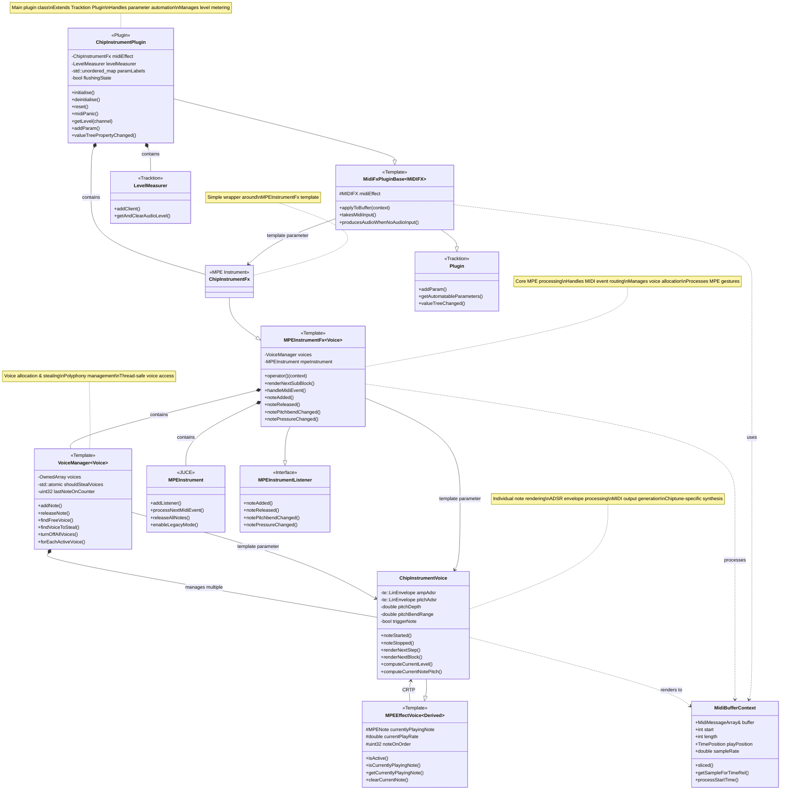

# ChipInstrumentPlugin Architecture

This document describes the architecture and class relationships of the ChipInstrumentPlugin system.

## Class Diagram

## Architecture Overview

The ChipInstrumentPlugin follows a layered architecture:

1. **Plugin Layer**: `ChipInstrumentPlugin` extends `MidiFxPluginBase` and provides the Tracktion Engine plugin interface
2. **MIDI Effect Layer**: `ChipInstrumentFx` wraps the MPE instrument functionality
3. **MPE Processing Layer**: `MPEInstrumentFx` handles MPE events and voice management
4. **Voice Management Layer**: `VoiceManager` manages polyphonic voice allocation
5. **Voice Rendering Layer**: `ChipInstrumentVoice` renders individual notes with chiptune-specific synthesis

## Key Design Patterns

- **Template-based Composition**: Uses C++ templates for type-safe, zero-overhead composition
- **CRTP (Curiously Recurring Template Pattern)**: `MPEEffectVoice` uses CRTP for compile-time polymorphism
- **Observer Pattern**: MPE events are propagated through listener interfaces
- **Strategy Pattern**: Voice allocation and stealing algorithms are encapsulated in `VoiceManager`

## Data Flow

1. MIDI events enter through `ChipInstrumentPlugin::applyToBuffer()`
2. `MidiFxPluginBase` creates `MidiBufferContext` and calls the effect
3. `MPEInstrumentFx::operator()` processes MIDI events and manages voice allocation
4. Individual `ChipInstrumentVoice` instances render MIDI output with synthesis parameters
5. Final MIDI output is written back to the buffer for downstream processing